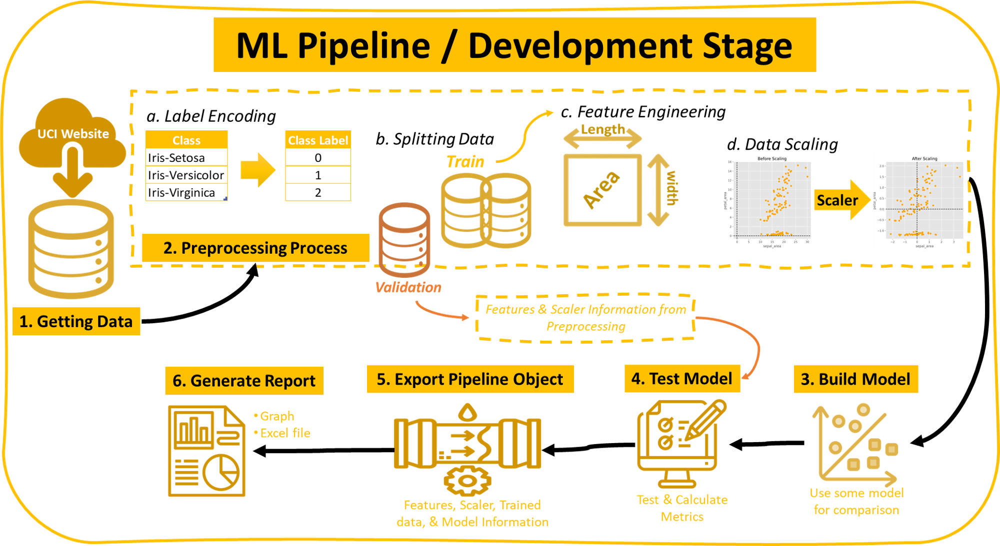
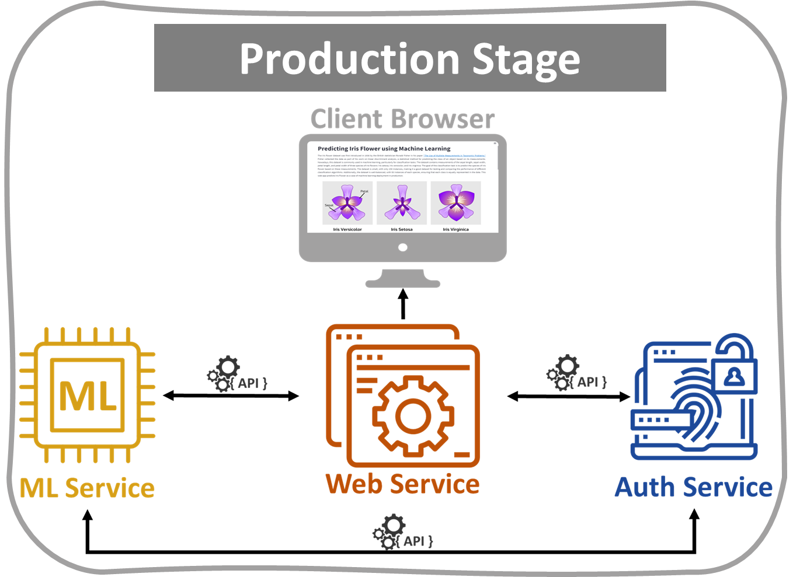
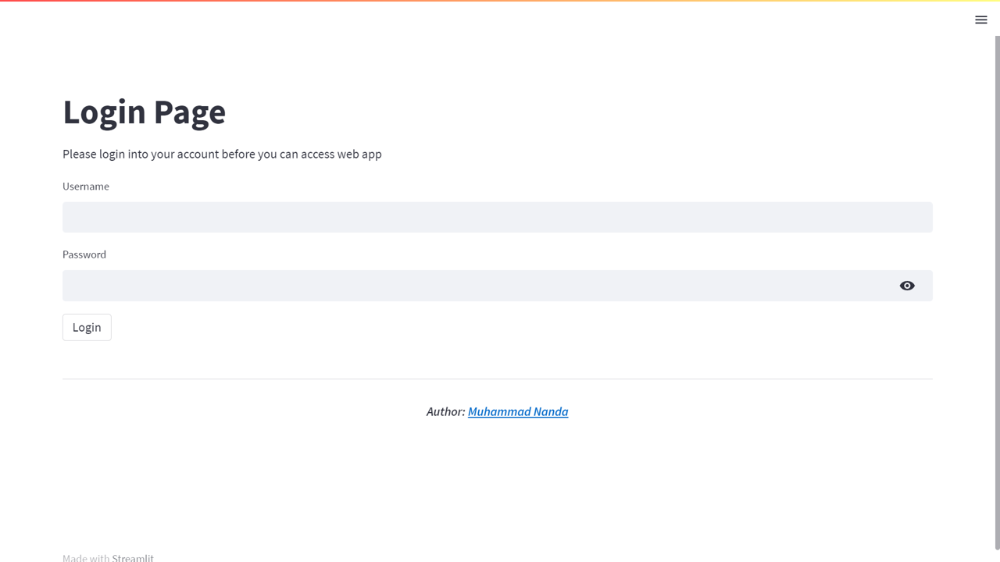
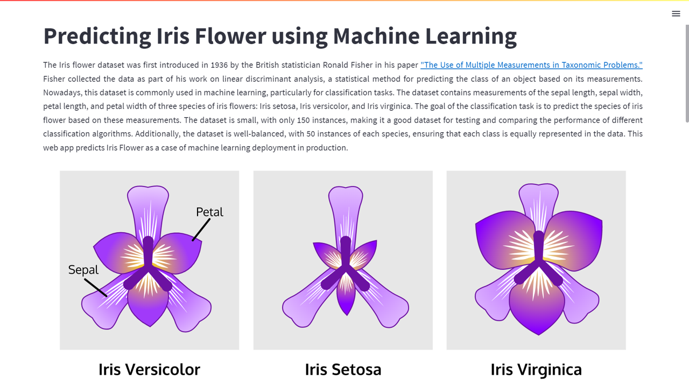
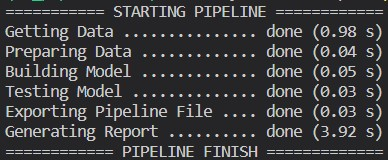
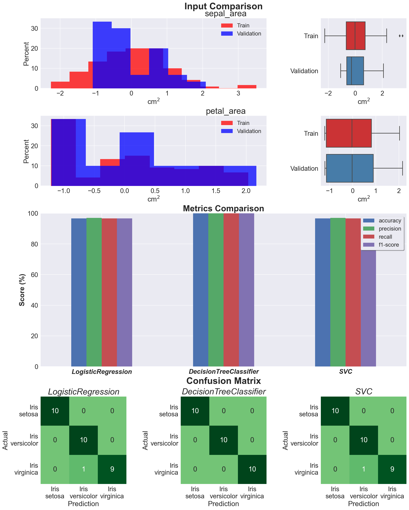
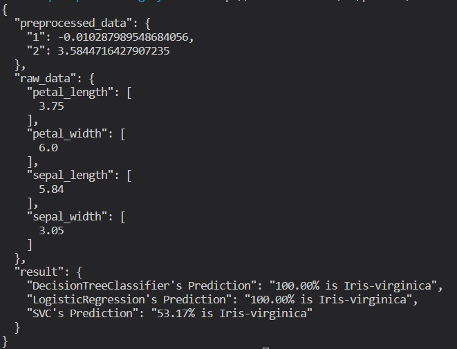
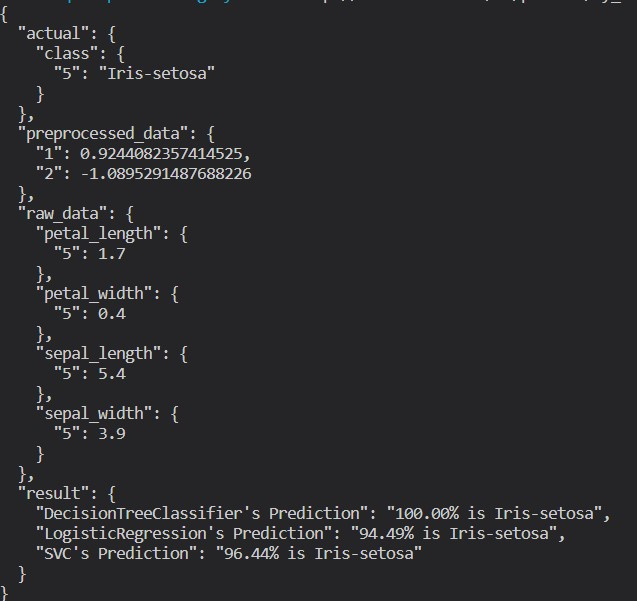
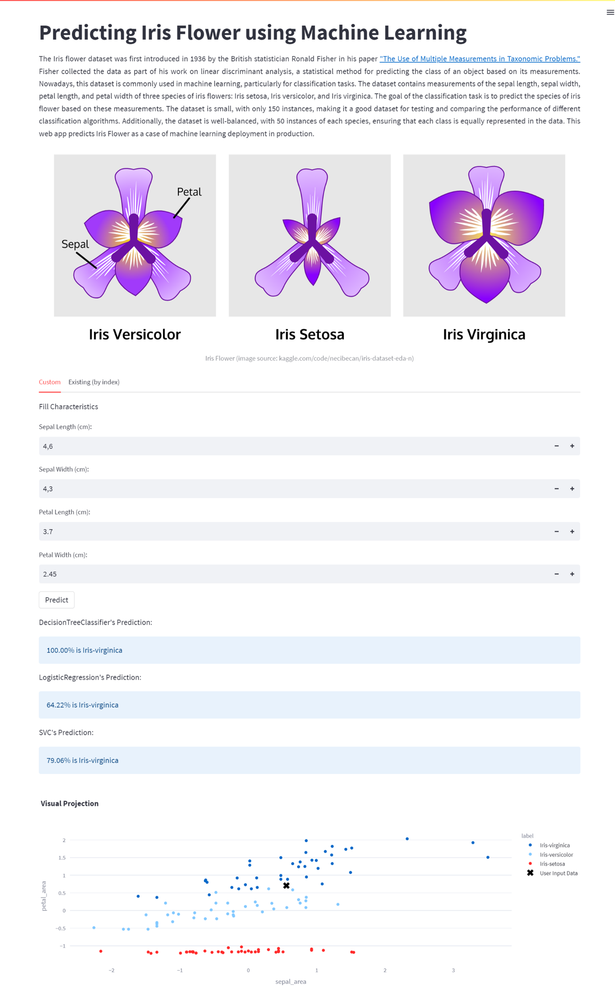
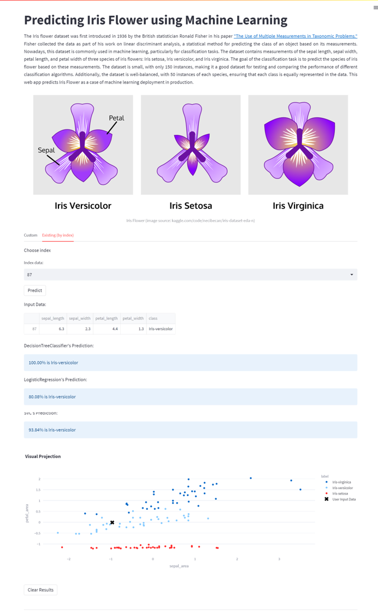

# End-to-End Machine Learning

## Project Description  

Building a machine learning pipeline that is effective and reliable can be a challenging task. One of the critical challenges is data leakage, where information from the future or target variable is inadvertently leaked into the training data, leading to over-optimistic model performance metrics. Another challenge is deploying the final model for real-world use, which requires integrating the model into an existing system and ensuring consistent performance over time.
  
This project provides an end-to-end process to address these challenges, from building to deploying machine learning models. The pipeline is designed to prevent data leakage and generate an automatic report for each run. Then, the model deploys as an API that can be used in a web app. This approach is to make model deployment more efficient and more manageable. It can be applied in a microservice architecture. In short, here are some interesting features that can be found in this project:
* A machine learning pipeline model that prevents data leakage and generates an automatic report (development stage).
* Microservices architecture approach consists of Authentication, Machine Learning, and Web App service.
* Consider a security with authentication and hiding credentials.

## Objective  

The objective of this project is:

- To build a machine learning pipeline that addresses data leakage issues.
- To deploy the model in the production stage for real-world use.
- To document the pipeline and deployment process for future reference.

## Contents  

The repository contains the following files and directories:  
- `img/`: A directory containing supported images for README.md.
- `result/`: A directory containing the result from the pipeline.
- `README.md`: A markdown file describing the project
- `pipeline.py`:  Python script that contains process in the development stage.
- `auth.py`:  Python script to build authentication service.
- `api.py`:  Python script to build a simple API as an endpoint for using machine learning models.
- `web_app.py`: Python scripts to build web apps for user interaction.
- `requirements.txt`:  Contains a list of important libraries for the project.
- `pipeline.bin`: Binary file that stores objects for the pipeline. 

## Data  

This project uses the iris dataset, which is popular in machine learning. It can be found in [UCI Dataset](https://archive.ics.uci.edu/ml/machine-learning-databases/iris/iris.data). This data was chosen because it is quite simple since this project emphasizes the pipeline and deployment process rather than model development. Here is the Attribute Information of the data:

1. `sepal_length`: sepal length measurement of Iris flower in cm.
2. `sepal_width`: sepal width measurement of Iris flower in cm.
3. `petal_length`: petal length measurement of Iris flower in cm.
4. `petal_width`: petal width measurement of Iris flower in cm.
5. `class`: class of Iris flower (Iris Setosa, Iris Versicolour, Iris Virginica).

## Approach  

In this section, I will explain the two main parts of this project, i.e., Machine Learning Pipeline Development and related services in Production.

### Development Stage  

The development of the machine learning pipeline can be found in the _pipeline.py_ file as follows:  
 
```python
  def run_pipeline(self):
    """
    Runs a machine learning pipeline from getting data until generating 
    the validation report.
    """
    print(f'{" STARTING PIPELINE ":=^42s}')
    self.get_data()
    self.prepare_data()
    self.build_model()
    self.test_model()
    self.export_file()
    self.generate_report()
    print(f'{" PIPELINE FINISH ":=^42s}')
```

This is the explanation of the main steps above:

- `self.get_data()` is the early step where the pipeline starts by obtaining the dataset from a remote server (the UCI Machine Learning Dataset Web). The data is loaded into a Pandas DataFrame.

- `self.prepare_data()`, part to prepare the data for modeling by following these steps:
  - Encode the class labels
  - Split the data into training and validation sets 
  - Apply feature engineering techniques 
  - Scale the training data

- `self.build_model()`, machine learning models are built in this step. For comparison purposes, 3 models are utilized: Logistic Regression, Decision Tree Classifier, and Support Vector Classifier. Each model is trained using the preprocessed training data.

- `self.test_model()` will evaluate the trained models using unseen / validation data, where it undergoes the same preprocessing processes as the training data first. Then, calculating various performance metrics for each model, including confusion matrices to visualize the model's predictive performance.

- `self.export_file()`, to facilitate model deployment, export the pipeline objects, including the scaler, label encoder, and trained models, into a binary file (.bin). This file can be easily loaded for inference in a production environment.

- `self.generate_report` is the final step that will generate a comprehensive report summarizing the pipeline's execution time, validation metrics comparison, and confusion matrices. The report is saved as an Excel file and a PNG image.

The Splitting data section at the beginning of preprocessing is the key to preventing data leakage in this project. Only a data train is used for the rest of the preprocessing process. Then the information obtained is stored for use in unseen data. The following is a schema that visualizes all the processes.

|  |
| :--: |
| Image 1: Development Stage Scheme |

### Production Stage  

Because it uses a microservice approach, in this production stage, there are 3 services: Authentication, Machine Learning, and Web App Services. The schematic can be seen in the image below.

|  |
| :--: |
| Image 2: Microservice Architecture at Production Stage |

#### Auth Service  

User authentication is a crucial aspect of web applications that ensures only authenticated users can access certain resources. In this project, we applied basic user authentication using Flask, a popular web framework, and JWT (JSON Web Tokens), a secure method for transmitting authentication information. For this service, two endpoints use to access the machine learning API and Web App: 

- Login Endpoint:
  The `/auth/login` route is defined to handle HTTP POST requests for user authentication. Upon receiving a request, the code retrieves the provided username and password from the request's JSON payload. It then verifies the credentials against the registered users. If the credentials are valid, an access token is generated using the `generate_access_token()` helper function and returned as a JSON response. Otherwise, an error message indicating invalid credentials is returned.   
- Access Token Validation Endpoint:
  The `/auth/validate/<access_token>` route is defined to handle HTTP GET requests for access token validation. The `<access_token>` parameter in the route represents the token to be validated. A JSON response with a token_valid value of True is returned if the token is valid. Otherwise, a token_valid value of False is returned to indicate an invalid token.  

#### Machine Learning (ML)-API

The ML API service is built using the Flask framework. It leverages the power of Flask to handle incoming requests and deliver predictions based on a pre-trained model from the development stage. The module defines two API routes, each handling a specific type of request:

- ```html
  /v1/predict/realtime/<sepal_length>/<sepal_width>/<petal_length>/<petal_width>`
  ``` 
  A route that is used for making predictions on custom input data.
- ```html 
  /v1/predict/by_index/<index>
  ``` 
  A route that retrieves existing data from a remote server and makes predictions based on that data.

Basically, both routes do this process:
- Token Validation: The module first validates the access token provided in the request headers. An appropriate error message is returned if the token is invalid or expired.
- Getting input data: the first route can be custom value based on the user, and the second route data from a remote server.
- Loading the Pipeline Object: The information about preprocessing and pre-trained model stored in pipeline.bin is loaded using joblib. The module returns the corresponding error message if the model file is not found or an error occurs during loading.
- Data Preprocessing: The retrieved input data underwent the same preprocessing process as during the development stage, with the same treatment based on information from pipeline.bin.
- Prediction: The preprocessed data is passed to the predict function, which iterates over the models in the pipeline and generates predictions for each model. The results include the predicted class and its probability for each model.
- Response: The module returns a JSON response containing the raw input data, the preprocessed data, and the prediction results.

#### Web Service  

Web service in this project focuses on classifying Iris flowers using machine learning, and it leverages two supporting services: an ML-Prediction Service and an Auth Service. For the user interface on the web, two pages are built:

- _Login Page_
  The web service features a login page that ensures secure access to the main application. Users are required to enter their credentials (username and password) to authenticate themselves. The authenticate function communicates with the Auth Service to validate the user's credentials. An access token is generated if the authentication is successful, allowing the user to proceed to the main page.  
  |  |
  | :--: |
  | Image 3: Web App Login Page Display |  
- _Main Page_  
  The main page of the web service is where the Iris flower classification takes place. It begins with the Iris flower story, followed by tabs that provide users with two options: a custom prediction based on user-inputted characteristics or an existing prediction using an index from the dataset. Streamlit's intuitive interface allows users to switch between these options seamlessly using tabs.
  |  |   
  | :--: |
  | Image 4: Web App Main Page Display |   

## Usage  

To use this project, follow these steps:
1. Clone this repository to your local machine: `git clone https://github.com/m-nanda/End-to-End-ML.git `

2. Go to the project folder in a terminal or command prompt
    ```bash
    cd End-to-End-ML
    ```

3. Create a virtual environment  
    ```bash
    python -m venv .venv
    ```

4. Activate virtual environment (windows)
    ```bash
    .venv/Scripts/activate
    ```

5. Install the necessary dependencies 
    ```bash
    pip install -r requirements.txt
    ```  
6. Create `.env` file to store credentials which at least contain:
    - `DATA_SOURCE` $ \rarr $  link to access Iris Dataset 
    - `SECRET_KEY` $ \rarr $ secret key for authentication
    - `USERS` $ \rarr $ dict of users and passwords to access API and Web App
    - `ALGORITHM` $ \rarr $ specific algorithm for authentication 
    - `AUTH_URL` $ \rarr $ endpoint of auth service
    - `VALIDATE_TOKEN` $ \rarr $ endpoint to validate token for authentication
    - `ML_API_1` $ \rarr $ endpoint of ml prediction with custom input data
    - `ML_API_2` $ \rarr $ endpoint of ml prediction for existing data

7. Run the pipeline:
    ```bash
    python pipeline.py
    ```
    If successful, the terminal will display information like the following (the time required may vary):
    |  | 
    | :--: |
    | Image 5: Result of pipeline.py in Terminal |
    

8. Run the Auth Service
    ```bash
    python auth.py
    ```

9. Run the ML-API
    ```bash
    python api.py
    ```

10. Run the Web App  
    ```bash
    streamlit run web_app.py
    ```

## Result  

1. Report  

   |  |   
   | :--: |
   | Image 6: Report of Machine Learning Models from Unseen Data |  

   From the following report, even though the validation data has a slightly different distribution, the test results with the three models used show results that are not much different. This makes sense because the iris dataset used is good.

2. Access Token
   To try to get an access token, you can run the following command:  

   ```bash
   $headers = @{"Content-Type" = "application/json"}
   $body = @{
      "username" = "<your-username>"
      "password" = "<your-password>"
   } | ConvertTo-Json
   $response = Invoke-RestMethod -Uri "http://localhost:5000/auth/login" -Method POST -Headers $headers -Body $body | Write-Host
   ```

3. Machine Learning Prediction
   To test the API, you can open the endpoint from the terminal with a token in the headers:
     - `curl -X POST -H "Auth: <token>" http://localhost:5002/v1/predict/realtime/5.84/3.05/3.75/6`  

     |  |  
     | :--: |  
     | Image 7: ML API Result in Terminal (`v1/predict/realtime/`'s route) |

     - `curl -X POST -H "Auth: <token>" http://localhost:5002/v1/predict/by_index/5`  

     |  |
     | :--: |  
     | Image 8: ML API result in terminal (`v1/predict/by_index/`'s route)|

4. Web App Use  
   The Web App runs on `http://localhost:8501`. After successful login, it will go to the main page. Here is the display and prediction result example: 
     - Prediction result of user custom input on web 
    
     |  |
     | :--: |
     | Image 9: Web App Tab _Custom_ and Prediction Result |

     - Prediction result of existing data 
    
     |  |
     | :--: |
     | Image 10: Web App Tab _Exsting (by index)_ and prediction result |  

## License  

This project is released under the MIT License. You are free to use, modify, and distribute this code as you wish.